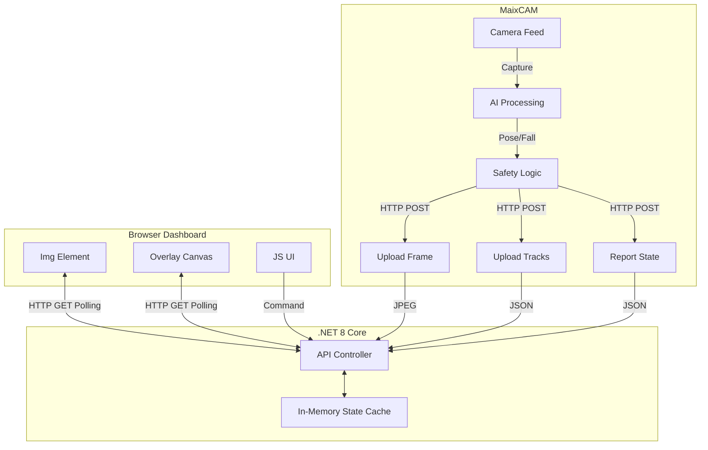
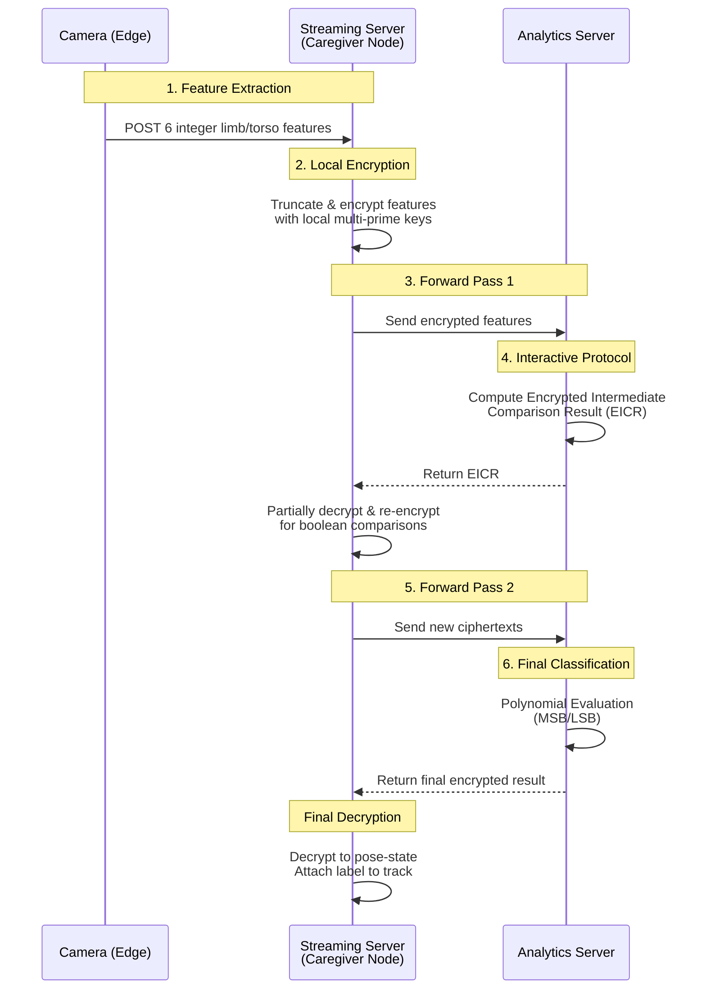

# Privacy-Preserving Patient Monitoring System - Streaming Server


The **Streaming Server** is the central hub of the distributed patient monitoring system. Unlike traditional streaming servers that rely on RTSP/WebRTC, this system implements a **custom HTTP-based Two-Pass Rendering** architecture designed for low-latency, synchronization-critical overlay rendering.

## 🔗 Related Repositories

This project is part of a distributed system:
*   [**Fall Detection Camera**](https://github.com/yudhisthereal/Private-Surveillence-MaixCAM): The Edge AI implementation running on MaixCAM devices (Python). handles skeleton detection and frame uploads.

## 🏗️ System Architecture

The system avoids complex streaming protocols (RTMP/WebRTC) in favor of a robust state-synchronization model where the server acts as a high-speed state cache.



### 1. Two-Pass Rendering Architecture (Web Client)

The web client (`streamDisplay.js` and `streamController.js`) implements a specialized rendering pipeline to ensure that skeleton overlays are always crisp and synchronous with the video feed, without "burning" them into the video stream on the server side.

#### Layering Stack
The visual output is composed of two absolute-positioned DOM elements stacked via Z-Index:

1.  **Bottom Layer (`z-index: 10`)**: ``
    *   **Source**: `/api/stream/frame` (or `/api/stream/background` in privacy mode)
    *   **Scaling**: CSS `object-fit: contain` to preserve aspect ratio.
    *   **Update Strategy**: Replaced via JS at ~30-60 FPS.
2.  **Top Layer (`z-index: 20`)**: `<canvas id="overlayCanvas">`
    *   **Source**: `/api/stream/tracks` (JSON data)
    *   **Scaling**: Resolution match (320x224 internal) scaled to display size via CSS.
    *   **Update Strategy**: Redrawn only when new track data arrives (event-driven).

#### Coordinate System & Scaling
*   **Native Resolution**: The MaixCAM processes at **320x224**. All keypoints and bounding boxes stored in the backend are in this coordinate space [0-320, 0-224].
*   **Client Scaling**: The client measures the actual display width of the container and sets the `<canvas>` internal resolution (`width`/`height` attributes) to match the display size (e.g., 1280x896).
*   **Transformation**:
    ```javascript
    scaleX = canvas.width / 320;
    scaleY = canvas.height / 224;
    screenX = keypoint.x * scaleX;
    screenY = keypoint.y * scaleY;
    ```
    This ensures that overlays align perfectly regardless of the browser window size or device pixel ratio.

#### Flicker Prevention
To prevent "flicker" (blank frames between updates), the system uses a **Double Buffering**-like approach for the background image mode:
*   The background image (`streamBackgroundImg`) is static DOM element.
*   When a new background is fetched, it is preloaded in a detached `Image()` object.
*   Only after `onload` fires is the DOM element's `src` swapped.
*   This ensures the user never sees a broken image icon or a blank flash during updates.

### 2. HTTP JPEG Polling vs WebRTC

*   **WebRTC**: While offering lower latency, synchronizing metadata (skeletons) with specific video frames is complex and error-prone without specialized tracks.
*   **HTTP Polling**: By rapidly polling the HTTP endpoint, we achieve "good enough" latency (~100-200ms) with perfect logical separation.
    *   **Video**: Recursive `onload` trigger ensures max possible frame rate.
    *   **Data**: Periodic polling allows the UI to remain responsive even if video lags.

### 3. Homomorphic Encryption (HME) Synchronization Pipeline

The system ensures absolute privacy by performing complex pose classification on an external Analytics server using Homomorphic Encryption. The Streaming Server acts as the **Caregiver Node** in this flow. 

Because the Analytics computations require multiple round-trips to evaluate, the Streaming Server implements a synchronous blocking architecture. When a camera submits tracking data, the server pauses the entire frame's state commitment until the Analytics evaluation completes.

**The HME Flow:**



This ensures the user dashboard always sees the correct pose label perfectly synced to the exact video frame and skeleton keypoints that generated it, completely eliminating timeline desyncs.

## 📡 API Reference

The server exposes a RESTful API for camera management, state reporting, and data streaming. All endpoints are prefixed with `/api/Stream`.

### 📷 Camera Management

| Method | Endpoint | Description | Query Params / Body | Response |
| :--- | :--- | :--- | :--- | :--- |
| `POST` | `/register` | Register a new camera device | `?camera_id={string}` | `{ "camera_id": "...", "status": "pending", "message": "..." }` |
| `POST` | `/approve` | Approve a pending camera | Body: `{ "ipAddress": "...", "cameraName": "..." }` | `{ "status": "registered", "camera_id": "..." }` |
| `POST` | `/forget` | Remove a known camera | Body: `{ "cameraId": "..." }` | `{ "status": "success", "message": "..." }` |
| `GET` | `/pending` | List cameras waiting for approval | - | `{ "pending": [...], "count": N }` |
| `GET` | `/registered` | List all active cameras | - | `{ "cameras": [...], "count": N }` |
| `GET` | `/cameras` | Unified list of all cameras | - | `{ "cameras": [...], "connected_count": N }` |

### 🔄 State & Commands

| Method | Endpoint | Description | Query Params / Body | Response |
| :--- | :--- | :--- | :--- | :--- |
| `POST` | `/ping` | Keep-alive heartbeat | `?camera_id={string}` | `{ "status": "success", "timestamp": 1234, ... }` |
| `POST` | `/report-state` | Report device status (recording, online) | Body: `{ "camera_id": "...", "timestamp": 123, "status": "online", ... }` | `{ "status": "success", "message": "State report received" }` |
| `GET` | `/camera-state` | Get full server-side state of a camera | `?camera_id={string}` | JSON Dict with flags (e.g. `{"record": false, "_connected": true}`) |
| `GET` | `/camera-status` | Get lightweight status (online/recording) | `?camera_id={string}` | `{ "connected": true, "is_recording": false, ... }` |
| `GET` | `/is-background-updating` | Check background sync status | `?camera_id={string}` | `{ "background_update_pending": bool, ... }` |
| `POST` | `/command` | Send control command to server state | Body: `{ "cameraId": "...", "command": "toggle_record", "value": true }` | `{ "status": "success", "command": "...", "value": ... }` |

### 🖼️ Streaming (Images)

| Method | Endpoint | Description | Headers / Query Params | Response |
| :--- | :--- | :--- | :--- | :--- |
| `POST` | `/upload-frame` | Upload raw JPEG frame | Header: `X-Camera-ID: {id}` <br> Body: Binary JPEG | `{ "status": "success", "size": 1234 }` |
| `POST` | `/upload-bg` | Upload background reference frame | Header: `X-Camera-ID: {id}` <br> Body: Binary JPEG | `{ "status": "success", "size": 1234 }` |
| `GET` | `/frame` | Get latest live frame | `?camera_id={string}` | Binary JPEG Image (image/jpeg) |
| `GET` | `/background` | Get current background frame | `?camera_id={string}` | Binary JPEG Image (image/jpeg) |

### 🦴 Tracking & Data

| Method | Endpoint | Description | Query Params / Body | Response |
| :--- | :--- | :--- | :--- | :--- |
| `POST` | `/tracks` | Upload detected skeletons (Pose) | Body: `{ "camera_id": "...", "tracks": [...], "timestamp": 123.45 }` | `{ "status": "success", "tracks_processed": N }` |
| `GET` | `/tracks` | Get latest tracking data | `?camera_id={string}&track_id={opt}` | `{ "tracking_data": {...}, "track_count": N }` |
| `POST` | `/editable-areas` | Update safe/exclusion zones | Body: `{ "cameraId": "...", "editableAreas": [...] }` | `{ "status": "success", "areas_count": N }` |
| `GET` | `/safe-areas` | Get defined safe zones | `?camera_id={string}` | Array `[ [[x,y],...], ... ]` |
| `GET` | `/bed-areas` | Get defined bed zones | `?camera_id={string}` | Array `[ [[x,y],...], ... ]` |
| `GET` | `/floor-areas` | Get defined floor zones | `?camera_id={string}` | Array `[ [[x,y],...], ... ]` |

## 🚀 Installation & Dev

### 1. Manual Run (Recommended)
The system is now fully HTTP-based and requires no external streaming servers.

```bash
# Clone
git clone https://github.com/yudhisthereal/fall-detection-streaming.git
cd fall-detection-streaming

# Run setup (Installs .NET 8 SDK and Systemd service)
# This script has been updated to remove legacy SRS/Coturn dependencies.
sudo ./setup.sh

# During development, run with --build-only to apply the changes
sudo ./setup.sh --build-only

# Verify status
sudo systemctl status fall-detection-streaming
```

### 2. Manual Development Mode
If you prefer not to install system services:

```bash
cd FallDetection.Streaming
dotnet run --urls=http://0.0.0.0:8000
```

## 🔒 Security

-   **Volatile Memory**: Frames are held in RAM and strictly overwritten. No video is written to disk unless "Recording" is explicitly triggered (client-side implementation).
-   **Header Validation**: Uploads require `X-Camera-ID`.
-   **Input Sanitization**: All commands are validated against a whitelist in `StreamController.cs`.
